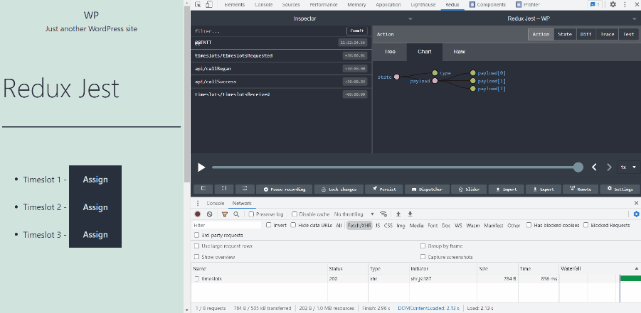
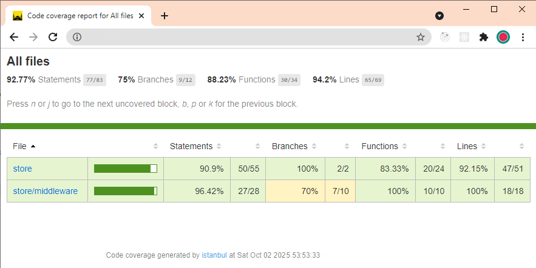
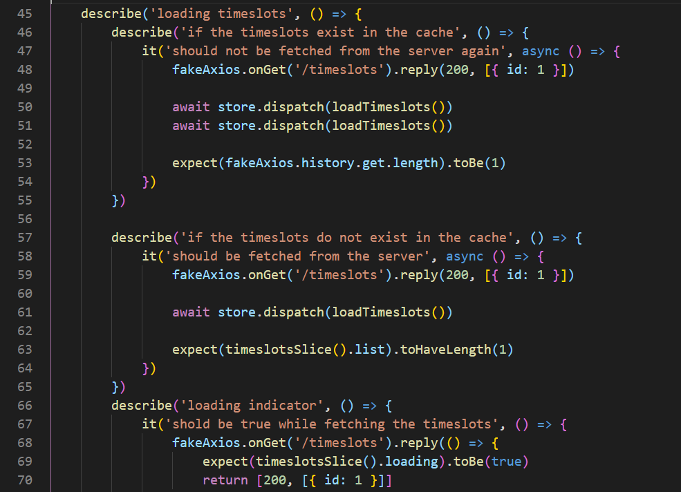
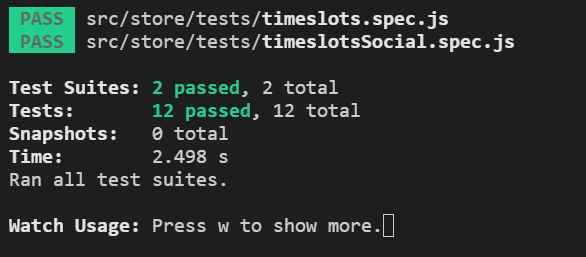

# WordPress Redux Store Middleware Testing with Jest

## Read the article on UDSSL

First, a WordPress REST API should be created to handle requests from the app. Then a Redux Store should be created using Redux Toolkit. We can create a redux store without Redux Toolkit. But we have to use a lot of boilerplate code. Middleware can be used to intercept the dispatched actions before reaching the store. Middleware can also dispatch additional actions if necessary. Let's create 3 simple middleware. Finally, let's write some tests with Jest for the store implementation.

[Read the article on UDSSL](https://udssl.com/wordpress-redux-store-middleware-testing-jest)

# NPM Install Commands

[Read the article on UDSSL](https://udssl.com/wordpress-redux-store-middleware-testing-jest)

npm install --save-dev webpack webpack-cli

npm install --save-dev sass-loader sass style-loader css-loader

npm install --save-dev babel-loader @babel/core @babel/preset-env @babel/preset-react @babel/plugin-transform-runtime

npm install --save react react-dom bootstrap

npm i --save-dev jest @types/jest axios-mock-adapter babel-jest

npm i @reduxjs/toolkit redux-devtools-extension reselect

